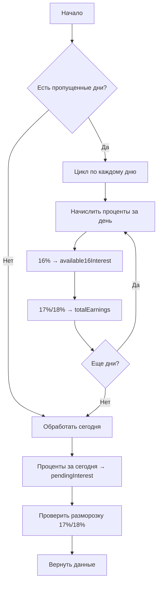

# 🔧 Исправление системы начисления процентов v5.0

## 📋 Обзор изменений

Полностью переработана система начисления процентов для обеспечения корректной работы при любой периодичности захода пользователя (день/неделя/месяц).

---

## ✅ Что было исправлено

### 1. **Критическая ошибка в структуре данных**
**Было:** `userDeposits` содержал депозиты + проценты 16%, что нарушало логику расчетов  
**Стало:** `userDeposits` содержит ТОЛЬКО депозиты/выводы, проценты хранятся отдельно

### 2. **Неправильное начисление процентов 16%**
**Было:** Проценты сразу добавлялись в доступный баланс  
**Стало:** 
- Проценты накапливаются в `pendingInterest` в течение дня
- В 00:00 переходят в `available16Interest` 
- Доступны для вывода, но НЕ для реинвестирования

### 3. **Отсутствие обработки пропущенных дней**
**Было:** При заходе после недели/месяца проценты начислялись некорректно  
**Стало:** Все пропущенные дни обрабатываются циклом с правильным начислением процентов

### 4. **Неправильная разморозка вкладов 17%/18%**
**Было:** Основная сумма и проценты не всегда становились доступными  
**Стало:** При истечении срока основа + проценты автоматически разблокируются

### 5. **Зависание синхронизации**
**Было:** `syncInFlight` мог остаться `true` навсегда  
**Стало:** Добавлен таймаут 30 секунд и гарантированный сброс флага

---

## 📊 Новая структура данных

### Google Sheets таблица HomerBot

| Колонка | Название | Описание |
|---------|----------|----------|
| 1 | username | Имя пользователя |
| 2 | investedAmount | Общая инвестированная сумма |
| 3 | balance | Визуальный баланс = userDeposits + totalEarnings |
| 4 | lastSync | Последняя синхронизация |
| 6 | effectiveRate | Эффективная ставка портфеля |
| 14 | lastAppliedMonth | Последний обработанный месяц |
| 15 | paidThisMonth | Выплачено в текущем месяце |
| 16 | availableForWithdrawal | ❌ НЕ ИСПОЛЬЗУЕТСЯ (устаревшее) |
| 17 | pendingInterest | Проценты за сегодня (разблокируются в 00:00) |
| 18 | lastDayProcessed | Последний обработанный день |
| 19 | **userDeposits** | ТОЛЬКО депозиты/выводы (БЕЗ процентов!) |
| 20 | **totalEarnings** | ВСЕ накопленные проценты |
| 21 | **available16Interest** | Разблокированные проценты 16% (новое!) |

### Формулы расчетов

```javascript
// Общий баланс (визуальный)
balance = userDeposits + totalEarnings

// Доступно для вывода
availableForWithdrawal = userDeposits + available16Interest - lockedPrincipal1718

// Доступно для инвестирования (проценты НЕ учитываются!)
availableForInvest = userDeposits - investedAmount

// Свободный баланс (то же что доступно для инвестирования)
freeBalance = availableForInvest

// Инвестировано
investedAmount = sum(all active investments)

// Доход за сегодня
todayIncome = computeInterestForPeriod(dayStart, now)
```

---

## 🔄 Алгоритм начисления процентов

### При каждой синхронизации (`syncBalance()`):



### Логика по типам вкладов:

#### 16% (Liquid):
1. Проценты начисляются с момента инвестиции (например, с 16:00)
2. Накапливаются в `pendingInterest` до конца дня
3. В 00:00 → переходят в `available16Interest`
4. Доступны для вывода, но НЕ для реинвестирования
5. Основная сумма доступна всегда

#### 17% (Stable):
1. Проценты начисляются непрерывно
2. Накапливаются в `totalEarnings` (визуально)
3. Хранятся в `accruedInterest` по каждой инвестиции
4. При разморозке (через 30 дней): основа + проценты → `available16Interest`
5. До разморозки основная сумма и проценты заблокированы

#### 18% (Aggressive):
1. Аналогично 17%, но срок разморозки 90 дней

---

## 🧪 Как тестировать

### Тест 1: Заход каждый день

1. **День 1, 10:00:**
   - Депозит 10,000₽
   - Проверить: `userDeposits = 10000`, `totalEarnings = 0`

2. **День 1, 16:00:**
   - Инвестиция 16% на 5,000₽
   - Проверить: `investedAmount = 5000`, `availableForInvest = 5000`

3. **День 2, 10:00:**
   - Проверить начисление за 14 часов (с 16:00 до 00:00):
   - Ожидаемо: `5000 * 0.16 / 365.25 * (14/24) ≈ 1.28₽`
   - `available16Interest ≈ 1.28`
   - `pendingInterest` содержит проценты с 00:00 до 10:00 ≈ 0.55₽

4. **Проверить вывод:**
   - `availableForWithdrawal = 10000 + 1.28 = 10001.28₽`
   - Можно вывести до 10001.28₽

5. **Проверить инвестирование:**
   - `availableForInvest = 10000 - 5000 = 5000₽`
   - Можно инвестировать только 5000₽ (проценты НЕ учитываются)

### Тест 2: Месяц без захода

1. **День 1, 10:00:**
   - Депозит 10,000₽
   - Инвестиция 16% на 10,000₽

2. **День 30, 10:00 (первый заход):**
   - Проверить начисление за 29 полных дней:
   - Ожидаемо: `10000 * 0.16 / 365.25 * 29 ≈ 127.12₽`
   - `available16Interest ≈ 127.12`
   - `totalEarnings ≈ 127.12 + проценты_за_сегодня`
   - `balance = 10000 + 127.12 = 10127.12₽`

3. **Проверить доступность:**
   - `availableForWithdrawal = 10000 + 127.12 = 10127.12₽` ✅
   - `availableForInvest = 10000 - 10000 = 0₽` ✅

### Тест 3: Разморозка 17%

1. **День 1, 10:00:**
   - Депозит 10,000₽
   - Инвестиция 17% на 10,000₽
   - Дата разморозки = День 31

2. **День 15:**
   - `lockedPrincipal1718 = 10000₽` ✅
   - `availableForWithdrawal = 0₽` ✅
   - `totalEarnings ≈ 10000 * 0.17 / 365.25 * 14 ≈ 65.22₽` ✅

3. **День 31 (после разморозки):**
   - Проценты за 30 дней: `10000 * 0.17 / 365.25 * 30 ≈ 139.76₽`
   - `available16Interest = 10000 + 139.76 = 10139.76₽` ✅
   - `availableForWithdrawal = 10000 + 10139.76 = 20139.76₽` ✅
   - `lockedPrincipal1718 = 0₽` ✅

### Тест 4: Проверка "не реинвестируются проценты"

1. **Начальное состояние:**
   - `userDeposits = 10000`
   - `available16Interest = 100` (накопленные проценты)
   - `investedAmount = 5000`

2. **Проверка:**
   - `availableForInvest = 10000 - 5000 = 5000₽` ✅
   - НЕ 10100 - 5000 = 5100₽ ❌

3. **Попытка инвестировать 5100₽:**
   - Должна быть заблокирована (не хватает средств)

---

## 🐛 Известные проблемы (исправлены)

### ❌ Проблема 1: Проценты добавлялись к userDeposits
**Статус:** ✅ ИСПРАВЛЕНО  
**Решение:** userDeposits меняется только при DEPOSIT/WITHDRAW

### ❌ Проблема 2: Цикл синхронизации зависал
**Статус:** ✅ ИСПРАВЛЕНО  
**Решение:** Добавлен таймаут 30с и гарантированный сброс `syncInFlight`

### ❌ Проблема 3: Пропущенные дни не обрабатывались
**Статус:** ✅ ИСПРАВЛЕНО  
**Решение:** Цикл обработки каждого пропущенного дня

### ❌ Проблема 4: Неправильная формула процентов
**Статус:** ✅ ИСПРАВЛЕНО  
**Решение:** Проценты начисляются с учетом времени создания инвестиции

---

## 📝 Чек-лист для проверки

- [ ] userDeposits содержит ТОЛЬКО депозиты/выводы
- [ ] Проценты 16% разблокируются в 00:00 следующего дня
- [ ] Проценты НЕ доступны для реинвестирования
- [ ] Пропущенные дни обрабатываются корректно
- [ ] Вклады 17%/18% размораживаются автоматически
- [ ] Синхронизация не зависает (таймаут 30с)
- [ ] Общий баланс = userDeposits + totalEarnings
- [ ] availableForWithdrawal учитывает заблокированные суммы
- [ ] availableForInvest = userDeposits - investedAmount

---

## 🔧 Для разработчиков

### Ключевые изменения в коде:

#### google_sheets_sync.js:
- `syncBalance()` - полностью переписана с циклом обработки дней
- `computeInterestForPeriod()` - учитывает время создания инвестиции
- `updateInvestmentAccrued_()` - новая функция для обновления процентов
- `getLockedPrincipal1718()` - новая функция для расчета заблокированной суммы
- `reapplyMissedApproved_()` - исправлена для работы только с userDeposits
- `findOrCreateUserRow_()` - добавлена инициализация колонки 21

#### app.js:
- `updateDashboard()` - использует новые поля из API
- `syncBalance()` - добавлен таймаут и защита от зависания
- `updateInvestButtonState()` - использует availableForInvest
- `updateWithdrawBtnState()` - использует availableForWithdrawal

### Версионирование:
- v4.2 - старая версия (с ошибками)
- v5.0 - новая версия (все исправлено)

---

## ⚠️ Важные примечания

1. **Миграция данных:** Существующие пользователи могут иметь неверные значения в `userDeposits`. Система автоматически пересчитает все при следующей синхронизации.

2. **Колонка 21:** Автоматически создается при первом запуске новой версии.

3. **Обратная совместимость:** Старые данные будут корректно обработаны благодаря проверкам и инициализации значений по умолчанию.

4. **Производительность:** При большом количестве пропущенных дней (>30) синхронизация может занять 2-3 секунды. Это нормально.

---

## 📞 Поддержка

При обнаружении проблем проверьте:
1. Версию кода (должна быть v5.0)
2. Наличие колонки 21 в таблице HomerBot
3. Логи в консоли браузера и Google Apps Script
4. Значения в таблице для конкретного пользователя

Все логи содержат версию: `v5.0-FIXED`